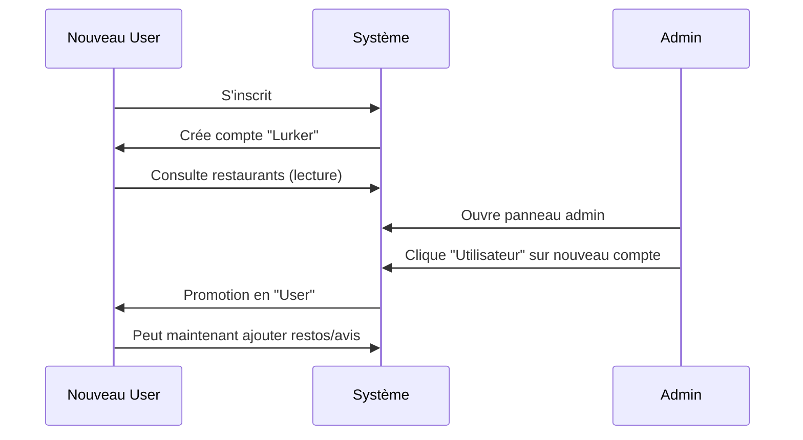
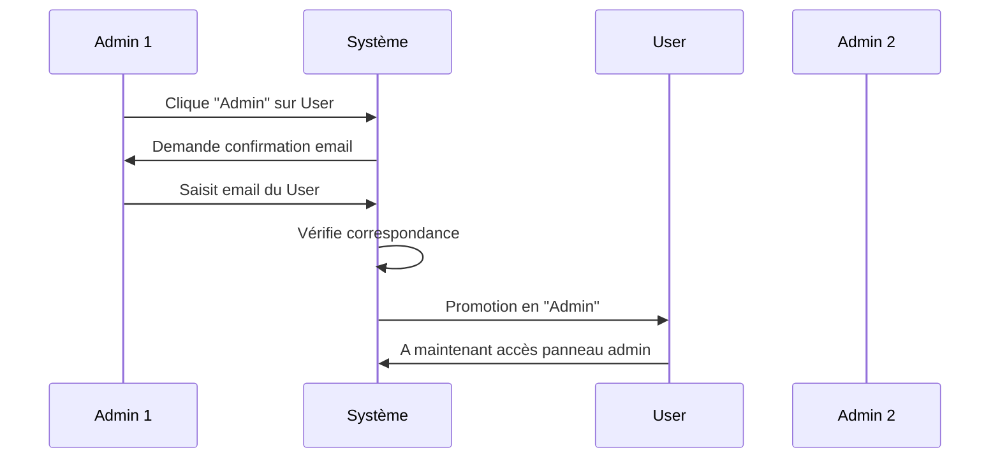

# 👥 Système de Gestion des Utilisateurs - KapaLunch

## Vue d'ensemble

KapaLunch dispose d'un système complet de gestion des utilisateurs avec 3 rôles différents et des fonctionnalités de promotion/rétrogradation.

## 🎭 Rôles utilisateur

### 1. **Lurker** (👁️ En attente)
- **Accès** : Lecture seule (consultation des restaurants et avis)
- **Restrictions** : 
  - Ne peut pas ajouter de restaurants
  - Ne peut pas publier d'avis
  - Ne peut pas noter les restaurants
- **Obtention** : Rôle par défaut lors de l'inscription
- **Icone** : `UserX` (lucide-react)
- **Couleur** : Jaune (#fbbf24)

### 2. **User** (✅ Utilisateur)
- **Accès** : Lecture et écriture
- **Permissions** :
  - Ajouter des restaurants
  - Publier des avis
  - Noter les restaurants
  - Modifier/supprimer ses propres avis
- **Obtention** : Promotion par un administrateur
- **Icone** : `UserCheck` (lucide-react)
- **Couleur** : Vert (#10b981)

### 3. **Admin** (🛡️ Administrateur)
- **Accès** : Accès complet
- **Permissions** :
  - Toutes les permissions User
  - Gérer les utilisateurs (promouvoir/rétrograder/supprimer)
  - Accès au panneau d'administration
  - Valider les lurkers en users
  - Promouvoir des users en admins
- **Obtention** : Promotion par un autre administrateur
- **Icone** : `Shield` (lucide-react)
- **Couleur** : Violet (#8b5cf6)

---

## 🔄 Transitions de rôles

### Diagramme des transitions possibles

```
    Lurker → User → Admin
      ↑       ↓       ↓
      └───────┴───────┘
```

### Scénarios de changement

#### 1. **Lurker → User**
- ✅ Simple clic sur le bouton "Utilisateur"
- ✅ Confirmation rapide
- ✅ Pas de sécurité supplémentaire

#### 2. **User → Admin**
- ⚠️ Confirmation par **saisie de l'email** de l'utilisateur
- 🚨 Modal de sécurité avec avertissement
- 💡 Indice affiché (3 premiers caractères de l'email)

#### 3. **Admin → User**
- ✅ Simple clic sur le bouton "Utilisateur"
- ✅ Confirmation rapide

#### 4. **User/Admin → Lurker**
- ✅ Possible pour rétrograder un utilisateur
- ⚠️ Révoque toutes les permissions d'écriture

---

## 🔒 Protections de sécurité

### 1. **Compte admin par défaut**
- ❌ Impossible à modifier
- ❌ Impossible à supprimer
- 🔐 Email : `admin`

### 2. **Auto-rétrogradation**
- ❌ Un admin ne peut pas se rétrograder lui-même
- ✅ Prévient la perte d'accès accidentelle

### 3. **Auto-suppression**
- ❌ Un admin ne peut pas supprimer son propre compte
- ✅ Garantit toujours un admin disponible

### 4. **Confirmation email pour promotion admin**
- 🔑 L'administrateur doit saisir l'email exact de l'utilisateur
- ✅ Prévient les promotions accidentelles
- 💡 Indice fourni : 3 premiers caractères

---

## 🛠️ Utilisation du panneau admin

### Accès au panneau

1. Cliquez sur votre **avatar** en haut à droite
2. Sélectionnez **"Panneau Admin"**
3. Le modal s'ouvre avec la liste des utilisateurs

### Interface du panneau

#### Tableau des utilisateurs

| Colonne | Description |
|---------|-------------|
| **Utilisateur** | Nom (avec badge "Vous" pour l'admin connecté) |
| **Email** | Adresse email de l'utilisateur |
| **Date d'inscription** | Date de création du compte |
| **Rôle** | 3 boutons cliquables + badge colorisé |
| **Actions** | Bouton de suppression (si autorisé) |

#### Boutons de rôle

```
[👁️] [✅] [🛡️]
 Lurker  User  Admin
```

- ⚪ **Blanc** : Rôle non actif (cliquable)
- 🔵 **Bleu** : Rôle actif (bloqué)
- 🔒 **Grisé** : Non modifiable (protection)

---

## 💻 API Backend

### Route principale : `PUT /api/users/:id/role`

#### Requête
```json
{
  "newRole": "admin",
  "emailConfirmation": "user@example.com"
}
```

#### Réponse (succès)
```json
{
  "success": true,
  "message": "John Doe est maintenant administrateur",
  "data": {
    "id": 5,
    "name": "John Doe",
    "email": "john@example.com",
    "role": "admin"
  }
}
```

#### Réponse (erreur)
```json
{
  "success": false,
  "message": "L'email de confirmation ne correspond pas"
}
```

### Autres routes

- **`GET /api/users/all`** : Liste tous les utilisateurs (admin)
- **`GET /api/users/lurkers`** : Liste uniquement les lurkers (admin)
- **`DELETE /api/users/:id`** : Supprimer un utilisateur (admin)

---

## ⚡ Workflow type

### Nouveau utilisateur



### Promotion admin



---

## 🎨 Personnalisation CSS

Le fichier `frontend/src/styles/admin-panel.css` contient tous les styles :

- `.admin-panel-modal` : Modal principal
- `.users-table` : Tableau des utilisateurs
- `.role-badge-btn` : Boutons de rôle cliquables
- `.email-confirm-modal` : Modal de confirmation email
- `.you-badge` : Badge "Vous"
- `.btn-delete-user` : Bouton de suppression

---

## 📝 Notes importantes

### Lurkers vs Users

- Les **lurkers** permettent de valider manuellement les nouvelles inscriptions
- Évite le spam et les comptes indésirables
- L'admin peut voir les nouveaux inscrits avant de leur donner l'accès complet

### Multi-admins

- ✅ Le système supporte plusieurs administrateurs
- ✅ Chaque admin peut promouvoir d'autres users en admins
- ❌ Aucun admin ne peut se rétrograder lui-même
- ✅ Un admin peut rétrograder un autre admin (sauf admin par défaut)

### Sécurité de la confirmation email

Pourquoi demander l'email pour promotion admin ?

1. **Double-vérification** : Force l'admin à vérifier l'identité
2. **Prévention erreurs** : Évite les clics accidentels
3. **Traçabilité** : L'admin doit consciemment taper l'email
4. **Audit** : Trace claire de l'intention

---

## 🚀 Améliorations futures possibles

- [ ] Logs d'audit des changements de rôles
- [ ] Notifications email lors de promotion
- [ ] Historique des rôles par utilisateur
- [ ] Permissions granulaires (au lieu de 3 rôles fixes)
- [ ] Groupes/équipes d'utilisateurs
- [ ] Approbation à 2 admins pour promotion admin
- [ ] Exportation CSV de la liste utilisateurs

---

## 🐛 Dépannage

### "Impossible de modifier le compte admin par défaut"

✅ **Normal** : Le compte `admin` / `admin` ne peut pas être modifié pour des raisons de sécurité.

### "Vous ne pouvez pas rétrograder votre propre compte"

✅ **Normal** : Demandez à un autre admin de le faire, ou gardez vos droits.

### La modal de confirmation email ne valide pas

❌ **Vérifiez** : Vous devez saisir l'email **exact** de l'utilisateur (sensible à la casse des caractères avant le @).

### Les boutons de rôle sont grisés

✅ **Normal** : Certains boutons sont désactivés selon les règles de sécurité :
- Compte admin par défaut
- Votre propre compte (rétrogradation)
- Rôle déjà actif

---

## 📚 Références

- **Backend** : `backend/src/routes/users.js`
- **Frontend** : `frontend/src/components/AdminPanel.jsx`
- **CSS** : `frontend/src/styles/admin-panel.css`
- **Middleware** : `backend/src/middleware/auth.js` (vérification rôle)

---

**Version** : 1.0  
**Dernière mise à jour** : Décembre 2025